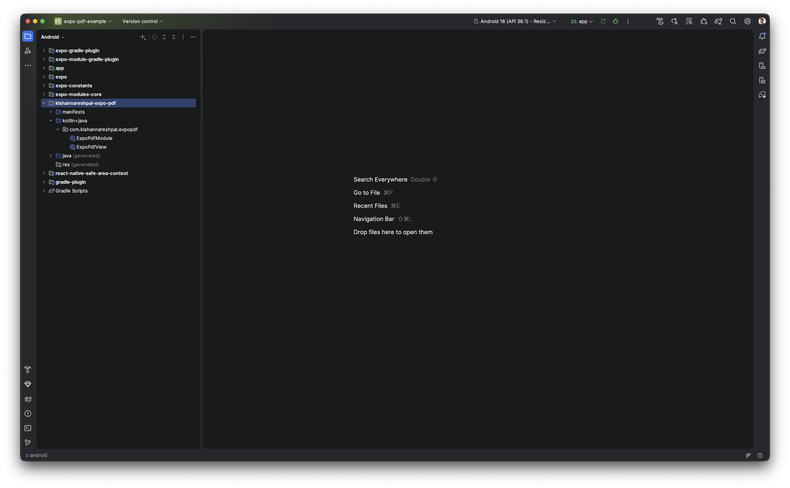
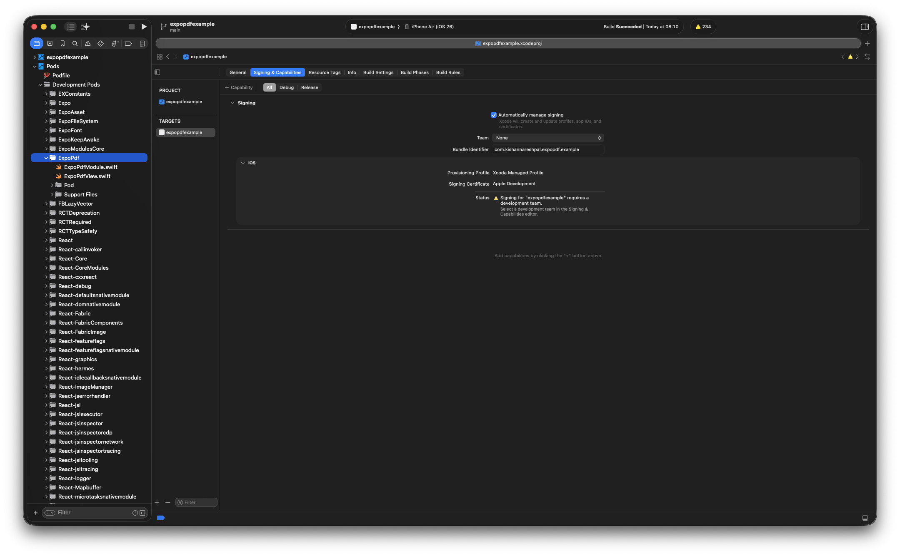

# Contributing to @kishannareshpal/expo-pdf

Thank you for your interest in contributing to `@kishannarehpal/expo-pdf`! This document provides guidelines and instructions for contributing to the project.

## Code of Conduct

Please be respectful and constructive in all interactions.

## Getting Started

Before you begin:

1. Fork and clone the repo:
   ```bash
   git clone https://github.com/your-username/expo-pdf.git
   cd expo-pdf
   ```
2. Add the upstream repository:
   ```bash
   git remote add upstream https://github.com/kishannareshpal/expo-pdf.git
   ```
3. Install dependencies
   ```bash
   bun install
   ```

## Development Setup

### Prerequisites

- **bun** (https://bun.com)
- **For iOS development**:
  - macOS (required)
  - Xcode (latest stable version)
  - CocoaPods: `sudo gem install cocoapods`
- **For Android development**:
  - Android Studio
  - Android SDK and build tools
  - Java Development Kit (JDK)

### Installation

1. **Install root dependencies**:

   ```bash
   bun install
   ```

2. **Install example app dependencies**:

   ```bash
   cd example
   bun install
   ```

### Edit the module source code

#### TypeScript

Edit the React Native binding TypeScript files from `src/` using your favorite editor, such as VS Code.

#### Android

Edit the Android native files by opening Android Studio: `bun open:android`



#### iOS

Edit the iOS native files by opening Xcode: `bun open:ios`



#### Resources

The following resources may be helpful as they represent the core of the project:

- [`Expo Modules API` documentation](https://docs.expo.dev/modules/module-api/)
- [`Apple PDFKit` documentation](https://developer.apple.com/documentation/pdfkit)
- [`AndroidX PDF` documentation](https://developer.android.com/jetpack/androidx/releases/pdf)

### Running the Example App

The `example/` directory contains a test app to develop and test the changes you make in the module. For example, if you make a change to either the Android / iOS native module, you will need to re-build and re-install the app on the device - this can be easily achieved by following:

1. Start the Metro bundler (if not already):

   ```bash
   cd example
   bun start
   ```

2. Install and run the app on iOS:

   ```bash
   cd example
   bun ios
   ```

3. Install and run the app on Android:

   ```bash
   cd example
   bun android
   ```

### Code Style Guidelines

1. **TypeScript/React**:
   - Use functional components with hooks
   - Prefer `const` over `let` when possible
   - Use meaningful, self-documenting variable and function names
   - Add TSDoc comments for public APIs when necessary
2. **Swift**:
   - Follow Swift style guide conventions
   - Use meaningful, self-documenting names for classes, functions, and variables
   - Add documentation comments for public APIs
3. **Kotlin**:
   - Follow Kotlin style guide conventions
   - Use meaningful names for classes, functions, and variables
   - Add KDoc comments for public APIs
4. **General**:
   - Keep functions focused and small
   - Write self-documenting code
   - Comment complex logic
   - Maintain consistency with existing codebase

## Testing

### Manual Testing

1. Use the example app to manually test your changes
2. Test on both iOS and Android platforms

## Submitting Changes

### Before Submitting

1. **Update the CHANGELOG.md**:
   - Add your changes under the appropriate version
   - Use the following format:
     - `### 🎉 New features` for new features
     - `### 🐛 Bug fixes` for bug fixes
     - `### 💡 Others` for other changes
     - `### 🛠 Breaking changes` for breaking changes
2. **Test your changes**:
   - Test on iOS
   - Test on Android
   - Verify the example app works correctly

### Pull Request Process

1. **Create a branch** from `main`:

   ```bash
   git checkout -b feature/your-feature-name
   # or
   git checkout -b username/your-bug-fix
   ```

2. **Make your changes**:
   - Write clean, well-documented code
   - Follow existing code patterns
   - Add tests if applicable
   - Update documentation as needed

3. **Commit your changes**:

   ```bash
   git add .
   git commit -m "feat: add support for password-protected PDFs"
   ```

   Use conventional commit messages:
   - `feat:` for new features
   - `fix:` for bug fixes
   - `docs:` for documentation changes
   - `style:` for formatting changes
   - `refactor:` for code refactoring
   - `test:` for adding tests
   - `chore:` for maintenance tasks

4. **Push to your fork**:

   ```bash
   git push origin feature/your-feature-name
   ```

5. **Create a Pull Request**:
   - Go to the GitHub repository
   - Click "New Pull Request"
   - Select your branch
   - Fill out the PR template with:
     - Description of changes
     - Testing performed
     - Screenshots/videos if applicable
     - Related issues (if any)

6. **Respond to feedback**:
   - Address any review comments
   - Make requested changes
   - Keep the PR up to date with `main`

### Pull Request Guidelines

- Keep PRs focused and reasonably sized
- One feature or fix per PR
- Include a clear description
- Reference related issues
- Ensure all CI checks pass
- Request review when ready

## Reporting Bugs

When reporting bugs, please include:

1. **Description**: Clear description of the issue
2. **Steps to Reproduce**: Detailed steps to reproduce the bug
3. **Expected Behavior**: What you expected to happen
4. **Actual Behavior**: What actually happened
5. **Environment**:
   - React Native version
   - Expo SDK version
   - iOS/Android version
   - Device or simulator information
6. **Screenshots/Videos**: If applicable
7. **Code Sample**: Minimal code example that reproduces the issue

## Requesting Features

When requesting features, please include:

1. **Use Case**: Why this feature would be useful
2. **Proposed Solution**: How you envision it working
3. **Alternatives**: Any alternative solutions you've considered
4. **Additional Context**: Any other relevant information

## Questions?

Feel free to:

- Open an issue for questions or discussions
- Start a discussion in the GitHub Discussions tab
- Contact the maintainer directly

Thank you for contributing to `@kishannareshpal/expo-pdf`! 🎉
